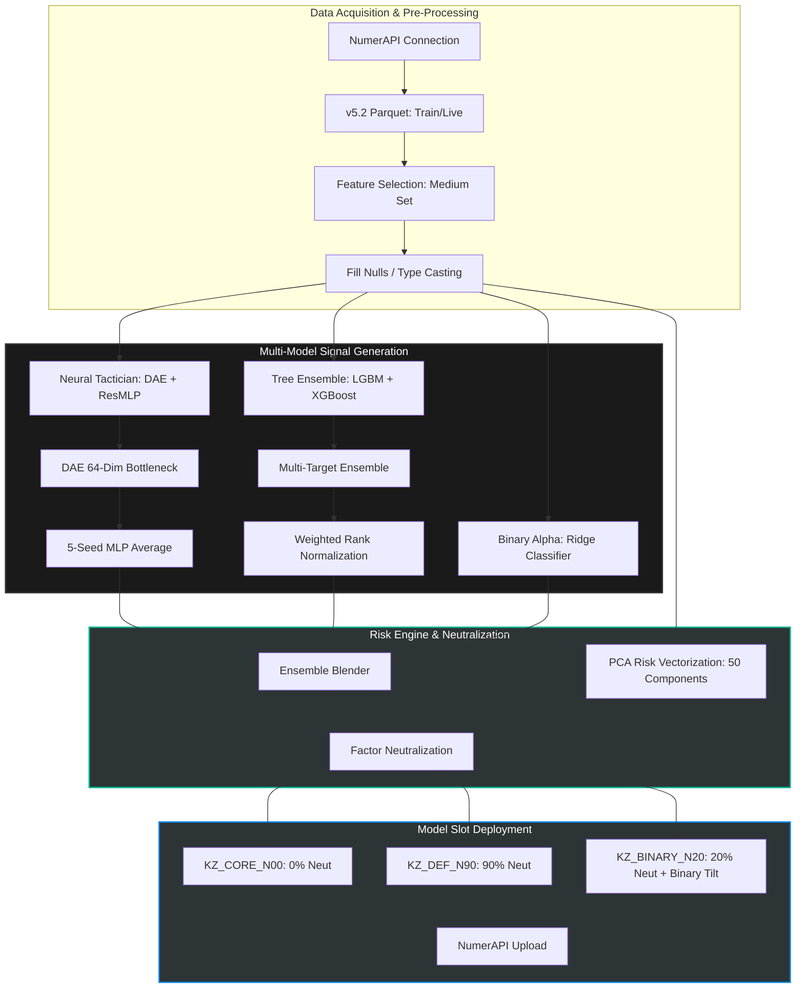

# Operation Overwatch v9.2

> **Status:** Deployment Ready | **Data Version:** v5.2 (Medium Feature Set) | **Classification:** Quantitative Alpha Research

## BLUF (Bottom Line Up Front)

Operation Overwatch v9.2 is a production-grade quantitative trading framework designed for the Numerai tournament. It utilizes a hybrid multi-target ensemble integrating deep gradient boosting, neural latent feature extraction, and high-regularization binary classification to navigate the v5.2 "Sunshine" data regime.

## Mission Profile

This repository serves as the primary research and execution engine for **Operation Iron Triad**. Developed by a retired U.S. Army Special Forces CSM with a DBA in Finance, this system transitions professional-grade risk management and tactical precision into the quantitative finance space.

- **Objective:** Maximize Sharpe and CORR on the Numerai leaderboard while maintaining strict factor neutrality.
- **Operational Status:** Active

## Systems Map

## Architectural Framework

### 1. Neural Tactician (DAE-MLP)

- **Bottleneck:** 64-dimension latent space (optimized for signal-to-noise ratio)
- **Initialization:** Denoising Autoencoder (DAE) with 0.1 swap noise
- **Prediction:** 5-seed Residual MLP (ResMLP) ensemble using SiLU activations and Batch Normalization

### 2. Multi-Target Tree Ensemble

- **Models:** LightGBM and XGBoost (10,000 max trees, 0.005 learning rate)
- **Targeting:** Weighted exposure to four specific objectives:

| Target | Weight |
|--------|--------|
| `target_ender_20` | 40% |
| `target_cyrusd_20` | 25% |
| `target_teager2b_20` | 20% |
| `target_victor_20` | 15% |

### 3. Binary Alpha

- **Input:** Raw features (780 dimensions)
- **Model:** Ridge Classifier (α = 10.0)
- **Function:** Tail-event detection and tactical tilt for the `KZ_BINARY_N20` model slot

## Model Risk Overlay

This component treats model error as a primary risk factor, deploying institutional-grade mitigation strategies to ensure portfolio stability:

| Risk Factor | Mitigation |
|-------------|------------|
| **Over-fitting** | Reverted neural latent bottleneck from 128 to 64 dimensions to force compressed, robust representation of the feature space |
| **Regime Shift** | Ensemble targets `ender`, `cyrusd`, `teager2b`, and `victor` concurrently to reduce reliance on any single market regime |
| **Signal Decay** | Ridge Classifier operates on raw feature inputs to capture tail events lost during PCA transformation |
| **Exposure Control** | 50-component PCA generates risk vectors, facilitating Ridge-based factor neutralization to align predictions with strict volatility bounds |

## Model Roster & Risk Configuration

| Slot Name | Blend Type | Neutralization | Tactical Focus |
|-----------|-----------|----------------|----------------|
| `KZ_CORE_N00` | Default | 0% | Raw Return Alpha |
| `KZ_DEF_N90` | Default | 90% | Defense / Low Volatility |
| `KZ_BINARY_N20` | Binary | 20% | Tail-Event Capture |

## Execution SOP

### Standard Training Cycle (Saturdays)

1. **Synchronize:** Download latest `train.parquet` and `features.json`
2. **Train:** Execute 5-fold Purged Walk-Forward CV (4-era gap)
3. **Validate:** Review CORR, Sharpe, and Max Drawdown diagnostics
4. **Persist:** Save model weights to Google Drive

### Daily Submission (Tue–Fri)

1. **Inference:** Load cached weights from `/Weights_v92/`
2. **Live Sync:** Pull daily `live.parquet`
3. **Neutralize:** Apply 50-component PCA risk neutralization
4. **Upload:** Deploy predictions via NumerAPI

## Technical Specifications

| Component | Detail |
|-----------|--------|
| **Environment** | Google Colab (Python 3.10+, A100 GPU) |
| **Workflow** | Primary capture via Evernote; deep research & docs in Obsidian |
| **Dependencies** | `polars`, `lightgbm`, `xgboost`, `pytorch`, `numerapi` |

## 👤 Author

**Brian Penrod, DBA**  
Retired U.S. Army Special Forces CSM | Doctor of Business Administration (Finance)

> “I combine military strategic planning with advanced quantitative finance to build systems that prioritize risk management, data integrity, and tactical execution.”
