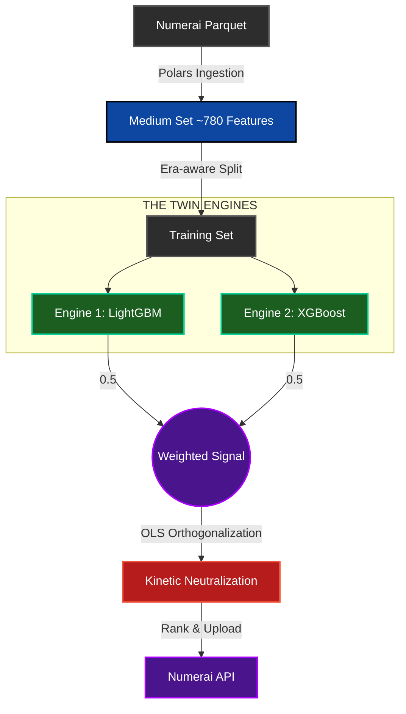

# PROJECT: KINETIC ZERO (v2.3)
**Production-Grade Quantitative Architecture for Global Equity Ranking**


---

## 👨‍💼 Executive Summary
**Author:** Dr. Brian Penrod, DBA  
**Codename:** **KINETIC ZERO**  
**Objective:** Generate rank-ordered predictive signals for the Numerai Tournament using a **Twin-Engine** ensemble (LightGBM + XGBoost) reinforced by **OLS orthogonalization / neutralization**.  
**Key Differentiator:** Strict adherence to **chronological regime separation** (no look-ahead bias) and **Phase 4 feature neutralization**.

---

## 🏗️ System Architecture (Kinetic Zero Protocol)
*For a detailed architectural deep dive, see [SYSTEM_MAP.md](SYSTEM_MAP.md).*


📚 Key Documentation

📄 Strategy White Paper: [whitepaper.md](https://github.com/brianpenrod/market-neutral-strategy/blob/09b9abc051107a5fa2ed859236dafbd4316b8902/whitepaper.md)

🗺️ System Map: [SYSTEM_MAP.md](SYSTEM_MAP.md)

⚙️ Core Capabilities
1) The “Chronological Firewall”

Standard K-Fold cross-validation is rejected to prevent look-ahead bias. This model uses an era-wise chronological split, training on the first ~80% of eras and validating strictly on the subsequent ~20%.

2) High-Performance Ingestion (Polars)

Utilizes Polars for fast Parquet ingestion and transformation, enabling rapid iteration in local or hosted environments (e.g., Colab).

3) Regime Adaptation (Twin-Engine Ensemble)

The ensemble combines LightGBM and XGBoost to capture both deep non-linear interactions and broader structural signals.

4) Kinetic Neutralization (Phase 4)

Post-processing applies OLS orthogonalization / neutralization to reduce linear correlations between predictions and the selected feature set, isolating more idiosyncratic signal from common risk factors.

🚀 Quick Start
```markdown
```bash
pip install -U numerapi lightgbm xgboost pandas polars pyarrow scipy
```
Execution (Production Mode)
```import os
from numerapi import NumerAPI

napi = NumerAPI(
    public_id=os.getenv("NAPI_PUBLIC_ID", "YOUR_ID"),
    secret_key=os.getenv("NAPI_SECRET_KEY", "YOUR_KEY"),
)

if napi.check_round_open():
    print(">>> ENGAGING KINETIC ZERO...")
    # TODO: load -> train -> ensemble -> neutralize -> rank -> upload
else:
    print(">>> Round is closed. Standing by.")
```
© 2026 Dr. Brian Penrod. All Rights Reserved.
