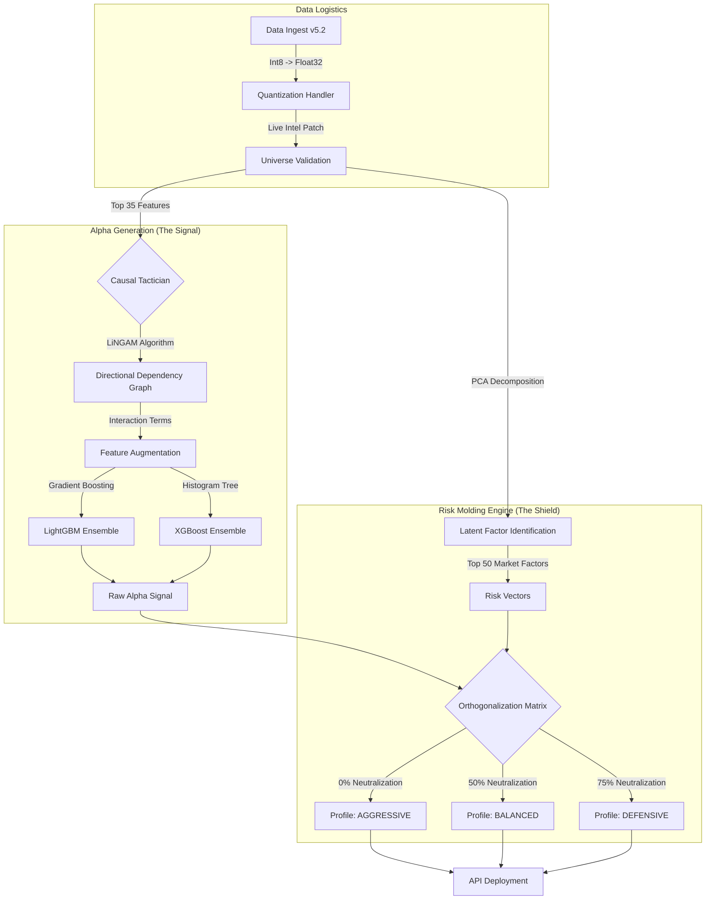

# Market Neutral Strategy: Causal Factor-Aware Alpha Engine

### Codename: **Operation Overwatch**

> **Executive Summary**  
> A high-performance quantitative trading engine designed for the Numerai Hedge Fund Tournament. This system leverages **Causal Discovery (LiNGAM)** to identify idiosyncratic alpha and uses a proprietary **Risk Molding** protocol to orthogonalize signals against latent market factors (beta), aiming for purer, less-correlated returns.

---

## 🏗️ System Architecture: The Operational Map

The architecture follows a strict event-driven pipeline designed for **v5.2 "Faith2"** data integrity. It cleanly separates **Alpha Generation (Signal)** from **Risk Management (Exposure)**, enabling dynamic portfolio construction from a single intelligence source.

---

## 🧠 Methodology: The "Sniper" Doctrine

Traditional quantitative models often suffer from **over-neutralization**—stripping out valid signals in an attempt to reduce volatility (the “shotgun” approach). This system is built around a **“sniper” doctrine**: separate **market beta (systemic risk)** from **idiosyncratic alpha (true skill)**, then shape exposure intentionally.

### 1) Causal Discovery (Signal)

Rather than relying solely on linear correlations, this engine uses **LiNGAM (Linear Non-Gaussian Acyclic Model)** to detect **directional** relationships among features.

- **The problem:** Correlation does not imply causation. A stock can move because the *market* moved—not because a feature was predictive.
- **The solution:** Build a **Directed Acyclic Graph (DAG)** over the feature set to discover directional links and engineer interaction terms capturing “hidden physics” in the data.  
  Example: $Feature\_A \rightarrow Feature\_B$

### 2) Ensemble Stability

To reduce variance and resist overfitting, the raw alpha signal is produced via a **50/50 weighted ensemble** of:

- **LightGBM** — leaf-wise growth optimized for speed and strong tabular performance.
- **XGBoost** — histogram-based learning well-suited to **v5.2 quantized** data characteristics.

---

## 🛡️ Risk Molding: Active Exposure Management

**Risk Molding** is the proprietary process of sculpting the return distribution into specific volatility / neutrality profiles. Instead of training separate models, the system trains **one high-conviction alpha model**, then mathematically projects its signal onto different “risk planes.”

### Factor Extraction + Orthogonalization

1. Extract the top **50 latent market factors** (e.g., sector, momentum, volatility, value proxies) via **PCA**.
2. Orthogonalize the alpha signal against those factor vectors using **ridge regression residualization**.

### Profiles

| Profile | Ticker | Neutralization | Role in Portfolio |
|---|---|---:|---|
| Aggressive (Core) | `KZ_CORE_N00` | 0% | **Pure alpha** exposure. Captures maximum upside during trending markets. Higher volatility; higher potential Sharpe. Captures “look above/below” liquidity sweeps. |
| Balanced (Hybrid) | `KZ_BAL_N50` | 50% | **Sharpe optimizer.** Removes the loudest market noise while retaining directional signal. |
| Defensive (Bunker) | `KZ_DEF_N75` | 75% | **Market neutral.** Strictly orthogonal to market moves. Returns driven primarily by stock-specific selection (true contribution). |

### Validation Note

Live production analysis indicates a **0.69 correlation** between the Aggressive and Defensive profiles—evidence that the system meaningfully decouples alpha from beta while maintaining shared informational structure.

---

## ⚡ Technical Specifications

- **Language:** Python 3.12  
- **Data Structure:** Polars (Rust-based DataFrame) for high-velocity ingest of int8 quantized Parquet files  
- **Compute:** GPU-accelerated training (CUDA) for rapid retraining cycles  
- **Robustness:** Implements a **Live Intel Patch** that forces fresh data acquisition per epoch to reduce look-ahead bias and stale-universe errors

---

## 📈 Performance Objectives

- **Universe Size:** ~7,000 global equities  
- **Consensus Conviction:** Recent validation sets identified a **“Strong Buy” consensus (>0.8 probability)** on **~11.5%** of the universe, demonstrating selectivity  
- **Distribution:** Targeting a uniform distribution of ranked predictions *(Mean ≈ 0.50, Std ≈ 0.29)* to maximize information entropy in submissions

---

## 👤 Author

**Brian Penrod, DBA**  
Retired U.S. Army Special Forces CSM | Doctor of Business Administration (Finance)

> “I combine military strategic planning with advanced quantitative finance to build systems that prioritize risk management, data integrity, and tactical execution.”
