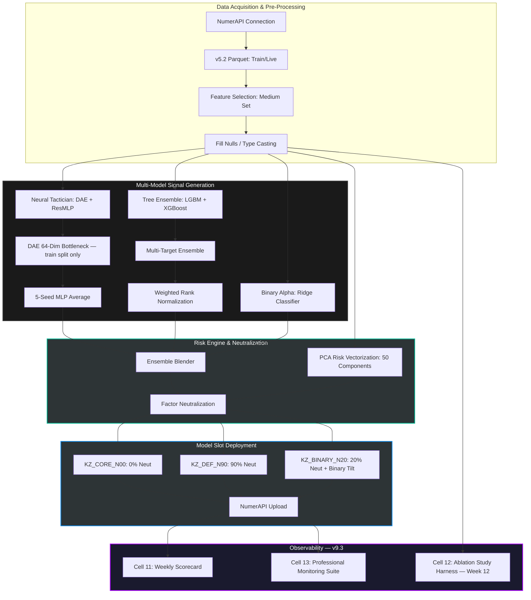

# Operation Overwatch v9.3

> **Status:** Deployment Ready | **Data Version:** v5.2 (Medium Feature Set) | **Classification:** Quantitative Alpha Research

## BLUF (Bottom Line Up Front)

Operation Overwatch v9.3 is a production-grade quantitative trading framework designed for the Numerai tournament. It utilizes a hybrid multi-target ensemble integrating deep gradient boosting, neural latent feature extraction, and high-regularization binary classification to navigate the v5.2 "Sunshine" data regime. v9.3 is a hardened release — it corrects a critical DAE training data leak present in v9.2, fixes daily inference model object handling, and adds three institutional-grade operational modules for scoring, diagnostics, and ablation.

## Mission Profile

This repository serves as the primary research and execution engine for **Operation Iron Triad**. Developed by a retired U.S. Army Special Forces CSM with a DBA in Finance, this system transitions professional-grade risk management and tactical precision into the quantitative finance space.

- **Objective:** Maximize Sharpe and CORR on the Numerai leaderboard while maintaining strict factor neutrality.
- **Operational Status:** Active — Week 2 of 90-day no-touch ablation window (slots: KZ_CORE_N00, KZ_DEF_N90, KZ_BINARY_N20)

## Systems Map

## Architectural Framework

### 1. Neural Tactician (DAE-MLP)

- **Bottleneck:** 64-dimension latent space (optimized for signal-to-noise ratio)
- **Initialization:** Denoising Autoencoder (DAE) with GaussianNoise (σ = 0.1)
- **Prediction:** 5-seed Residual MLP (ResMLP) ensemble using SiLU activations and Batch Normalization
- **v9.3 Fix:** DAE now trains on train split only. v9.2 trained on `X_all`, leaking validation-era data into latent representations and inflating in-sample neural metrics.

### 2. Multi-Target Tree Ensemble

- **Models:** LightGBM and XGBoost (10,000 max trees, 0.005 learning rate)
- **Targeting:** Weighted exposure to four specific v5.2 objectives:

| Target | Weight |
|--------|--------|
| `target_ender_20` | 40% |
| `target_cyrusd_20` | 25% |
| `target_teager2b_20` | 20% |
| `target_victor_20` | 15% |

### 3. Binary Alpha

- **Input:** Raw features (780 dimensions)
- **Model:** Ridge Classifier (α = 10.0)
- **Function:** Tail-event detection and tactical tilt for the `KZ_BINARY_N20` model slot

## Model Risk Overlay

| Risk Factor | Mitigation |
|-------------|------------|
| **Data Integrity** | DAE trains on train split only — validation data excluded from latent representation learning (v9.3 fix) |
| **Over-fitting** | Neural latent bottleneck held at 64 dimensions to force compressed, robust feature representation |
| **Regime Shift** | Ensemble targets `ender`, `cyrusd`, `teager2b`, and `victor` concurrently to reduce reliance on any single market regime |
| **Signal Decay** | Ridge Classifier operates on raw feature inputs to capture tail events lost during PCA transformation |
| **Exposure Control** | 50-component PCA generates risk vectors, facilitating Ridge-based factor neutralization to align predictions with strict volatility bounds |

## Model Roster & Risk Configuration

| Slot Name | Blend Type | Neutralization | Tactical Focus |
|-----------|-----------|----------------|----------------|
| `KZ_CORE_N00` | Default | 0% | Raw Return Alpha |
| `KZ_DEF_N90` | Default | 90% | Defense / Low Volatility |
| `KZ_BINARY_N20` | Binary | 20% | Tail-Event Capture |

## Execution SOP

### Standard Training Cycle (Saturdays) — Cells 1–8

1. **Synchronize:** Download latest `train.parquet` and `features.json`
2. **Train:** Execute 5-fold Purged Walk-Forward CV (4-era purge gap)
3. **Validate:** Review CORR, Sharpe, and Max Drawdown diagnostics
4. **Persist:** Save model weights to Google Drive (`/Weights_v93/`)

### Daily Submission (Tue–Fri) — Cells 1–5, then Cell 9

1. **Inference:** Load cached weights from `/Weights_v93/`
2. **Live Sync:** Pull daily `live.parquet`
3. **Neutralize:** Apply 50-component PCA risk neutralization
4. **Upload:** Deploy predictions via NumerAPI

### Weekly Scorecard (Sunday/Monday) — Cells 1–5, then Cell 11

1. Pull `daily_model_performances` for each slot via Numerai API
2. Estimate market regime from top-50 leaderboard dispersion
3. Append scores and regime tag to `Overwatch/scorecard.csv`

### Professional Monitoring Suite (Weekly, with Cell 11) — Cell 13

Five-panel institutional diagnostics tracking process quality independent of tournament outcomes:

| Panel | Metric |
|-------|--------|
| Predicted vs. Realized | Correlation of submissions to resolved targets |
| Exposure Monitor | PCA + feature-group factor loadings |
| Turnover Tracker | Rank correlation between consecutive submissions |
| Drawdown Context | Current vs. bootstrapped historical drawdown distribution |
| Ensemble Disagreement | Component agreement score per submission |

### Ablation Study (Week 12) — Cells 1–8, then Cell 12

Six-variant component test on a purged validation split to isolate architectural contributions:

| Config | Description |
|--------|-------------|
| 1 | Trees Only — LGB+XGB on `target_ender_20` |
| 2 | Trees + DAE Latent (844 features) |
| 3 | Full Ensemble minus Binary Alpha |
| 4 | Full v9.3 Baseline (control) |
| 5 | Single Target (`ender_20` only) |
| 6 | Equal Weight Targets (25/25/25/25) |

## Technical Specifications

| Component | Detail |
|-----------|--------|
| **Environment** | Google Colab (Python 3.10+, T4 GPU) |
| **Weight Cache** | Google Drive `/Overwatch/Weights_v93/` |
| **Dependencies** | `polars`, `lightgbm`, `xgboost`, `pytorch`, `numerapi` |

## Version History

### v9.3 (Current)
- **FIX (Critical):** DAE data leak — autoencoder now trains on train split only
- **FIX:** `GaussianNoise` renamed from `SwapNoise` (implementation was always additive Gaussian)
- **FIX:** `predict_multi_target` handles both `Booster` and `LGBMRegressor` object types
- **OPT:** Removed `t_X_all` tensor (~3GB GPU memory savings)
- **ADD:** Cell 11 — Automated Weekly Scorecard
- **ADD:** Cell 12 — Ablation Study Harness
- **ADD:** Cell 13 — Professional Monitoring Suite

### v9.2
- Multi-Target Tree Ensemble with corrected v5.2 targets
- DAE bottleneck reverted to 64 dimensions (128-dim degraded Neural Sharpe)
- Binary Alpha restored to raw features (PCA reduced CORR from 0.683 to 0.310)
- Binary Alpha regularization increased to α = 10.0

### v9.1
- Introduced 3-layer encoder and 128-dim DAE bottleneck (subsequently reverted)
- Deep tree params established (10,000 max trees, lr = 0.005, min_child = 500)

### v9.0
- Initial Combined Arms architecture: LGB + XGB + DAE ResMLP + Binary Alpha
- 3-slot risk neutralization framework (N00 / N90 / N20)

## 👤 Author

**Brian Penrod, DBA**
Retired U.S. Army Special Forces CSM | Doctor of Business Administration (Finance)

> "I combine military strategic planning with advanced quantitative finance to build systems that prioritize risk management, data integrity, and tactical execution."
