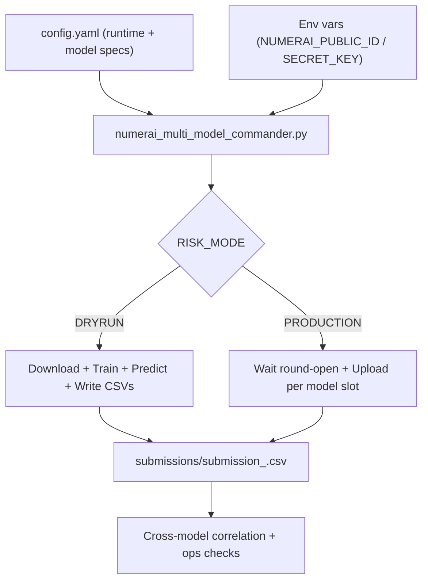

# PROJECT: KINETIC ZERO (v2.3)
**Production-Grade Quantitative Deployment for Numerai (Multi-Model Ops + Research Loop)**

---

## Executive Summary
**Author:** Dr. Brian Penrod, DBA  
**Codename:** **KINETIC ZERO**  
**Mission:** Generate rank-ordered predictive signals for the Numerai Tournament via a controlled, reproducible pipeline.  
**Architecture:** Multi-slot deployment using a **Twin-Engine ensemble** (LightGBM + XGBoost) with optional **feature neutralization** and optional **de-meta orthogonalization**.  
**Key Discipline:** **Chronological regime separation** (no look-ahead bias) + strict **ops safety gates** (DRYRUN by default).

---

## System Architecture
For the detailed operational diagram, see **[SYSTEM_MAP.md](SYSTEM_MAP.md)**.

### Executive Map (one-screen view)

© 2026 Dr. Brian Penrod. All Rights Reserved.
