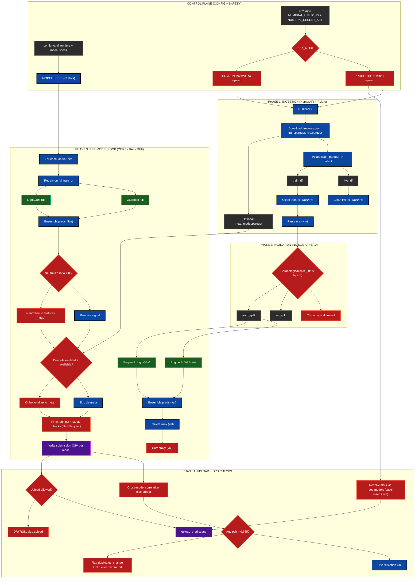

# Kinetic Zero — System Map (Multi-Model Numerai Commander)

This diagram shows the end-to-end control plane, data ingestion, per-model training loop, risk gates (DRYRUN vs PROD), and upload safeguards for the three-slot deployment.

## Legend
- **Raw**: datasets, config, environment variables  
- **Process**: ingestion, transforms, orchestration steps  
- **Model**: LightGBM / XGBoost training + inference components  
- **Logic**: safety gates, splits, neutralization / de-meta decisions  
- **Output**: CSV artifacts + Numerai API uploads
