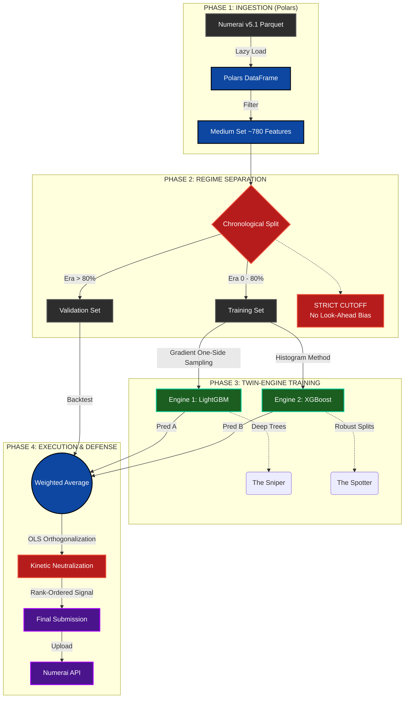

# System Architecture: Project Kinetic Zero
**Status:** Production (v2.3)
**Codename:** KINETIC ZERO
**Infrastructure:** Google Colab Pro+ / NVIDIA A100

## Architectural Deep Dive

### 1. The "Twin-Engine" Doctrine (Ensemble Theory)
**Strategic Intent:** Variance Reduction & Signal Stability.

In high-noise financial environments, single-model architectures often suffer from idiosyncratic overfitting. To mitigate this, we deploy a **Heterogeneous Ensemble**:

* **Engine 1: LightGBM ("The Sniper"):** Uses Gradient-based One-Side Sampling (GOSS) to capture deep, non-linear interactions in the feature set.
* **Engine 2: XGBoost ("The Spotter"):** Uses Histogram-based splitting (`tree_method='hist'`) to identify broad structural market patterns.

**The Output:**
By averaging the rank-normalized predictions ($0.5 \cdot P_{LGBM} + 0.5 \cdot P_{XGB}$), we effectively cancel out the uncorrelated errors of each individual model, stabilizing the Sharpe Ratio.

---

### 2. The "Chronological Firewall" (Stationarity Defense)
**Strategic Intent:** Elimination of Look-Ahead Bias.

Standard Random K-Fold Cross-Validation is rejected. We enforce a strict **Chronological Firewall**:

* **Time-Series Split:** The dataset is ordered by `Era` (Time).
* **The Cutoff:** The model is trained *only* on the first 80% of history.
* **The Test:** Validation occurs *only* on the subsequent 20%, ensuring the model is tested on "unseen future" data.

This respects the **Non-Stationarity** of financial markets—acknowledging that the statistical properties of the past do not perfectly mirror the future.

---

### 3. Kinetic Neutralization (Phase 4 Risk Management)
**Strategic Intent:** Market Neutrality (Zero Beta).

This is the defining upgrade of the v2.3 architecture. Raw model predictions often correlate linearly with broad market risk factors (volatility, momentum, size). We do not want to bet on "The Market"; we want to bet on "Alpha."

**The Protocol:**
We apply **OLS (Ordinary Least Squares) Orthogonalization** to the final predictions before submission.

* **Input:** The raw Weighted Average signal.
* **Logic:** We regress the signal against the feature set to isolate the component that is purely "beta."
* **Math:** $P_{neutral} = P_{raw} - \beta \cdot (Features)$
* **Outcome:** The resulting signal is mathematically orthogonal (perpendicular) to the risk factors. This creates a "Zero Beta" portfolio that generates returns based on stock-specific performance, independent of whether the S&P 500 rises or falls.
