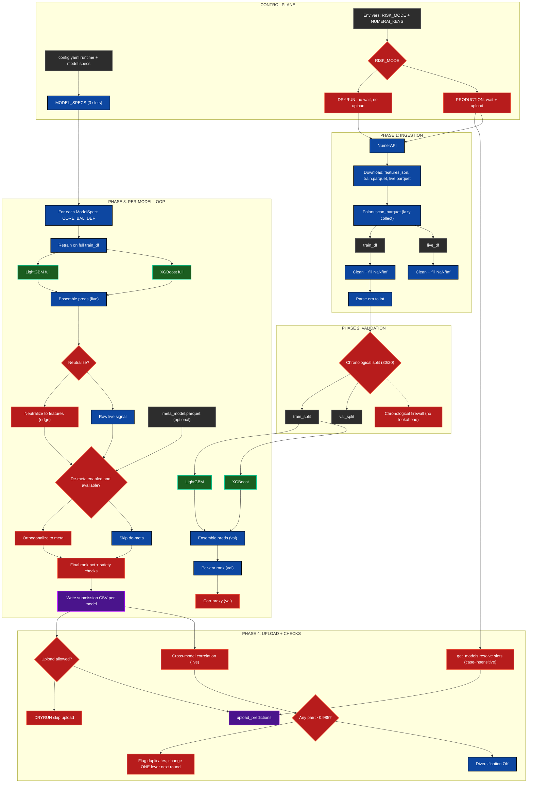

```mermaid
graph TD
  classDef raw fill:#2d2d2d,stroke:#555,stroke-width:2px,color:#fff;
  classDef process fill:#0D47A1,stroke:#000,stroke-width:2px,color:#fff;
  classDef model fill:#1B5E20,stroke:#00cc96,stroke-width:2px,color:#fff;
  classDef logic fill:#b71c1c,stroke:#ef553b,stroke-width:2px,color:#fff;
  classDef output fill:#4a148c,stroke:#aa00ff,stroke-width:2px,color:#fff;

  subgraph CONTROL["CONTROL PLANE"]
    cfg["config.yaml runtime + model specs"]:::raw --> spec["MODEL_SPECS (3 slots)"]:::process
    env["Env vars: RISK_MODE + NUMERAI_KEYS"]:::raw --> gate{"RISK_MODE"}:::logic
    gate --> dry["DRYRUN: no wait, no upload"]:::logic
    gate --> prod["PRODUCTION: wait + upload"]:::logic
  end

  subgraph INGESTION["PHASE 1: INGESTION"]
    api["NumerAPI"]:::process --> dl["Download: features.json, train.parquet, live.parquet"]:::process
    dl --> polars["Polars scan_parquet (lazy collect)"]:::process
    polars --> train["train_df"]:::raw
    polars --> live["live_df"]:::raw
    train --> clean["Clean + fill NaN/Inf"]:::process
    live --> clean2["Clean + fill NaN/Inf"]:::process
    clean --> era["Parse era to int"]:::process
  end

  subgraph VALIDATION["PHASE 2: VALIDATION"]
    era --> split{"Chronological split (80/20)"}:::logic
    split --> tr["train_split"]:::raw
    split --> va["val_split"]:::raw
    split -.-> note1["Chronological firewall (no lookahead)"]:::logic
  end

  subgraph MULTI["PHASE 3: PER-MODEL LOOP"]
    spec --> loop["For each ModelSpec: CORE, BAL, DEF"]:::process
    tr --> lgbm["LightGBM"]:::model
    tr --> xgb["XGBoost"]:::model

    lgbm --> ensV["Ensemble preds (val)"]:::process
    xgb --> ensV
    ensV --> rankV["Per-era rank (val)"]:::process
    rankV --> corr["Corr proxy (val)"]:::logic

    loop --> retrain["Retrain on full train_df"]:::process
    retrain --> lgbmF["LightGBM full"]:::model
    retrain --> xgbF["XGBoost full"]:::model

    lgbmF --> ensL["Ensemble preds (live)"]:::process
    xgbF --> ensL

    ensL --> neut{"Neutralize?"}:::logic
    neut --> neutLive["Neutralize to features (ridge)"]:::logic
    neut --> rawLive["Raw live signal"]:::process

    meta["meta_model.parquet (optional)"]:::raw --> demeta{"De-meta enabled and available?"}:::logic
    neutLive --> demeta
    rawLive --> demeta
    demeta --> orth["Orthogonalize to meta"]:::logic
    demeta --> noorth["Skip de-meta"]:::process

    orth --> final["Final rank pct + safety checks"]:::logic
    noorth --> final
    final --> csv["Write submission CSV per model"]:::output
  end

  subgraph OPS["PHASE 4: UPLOAD + CHECKS"]
    prod --> slots["get_models resolve slots (case-insensitive)"]:::logic
    csv --> allow{"Upload allowed?"}:::logic
    allow --> skip["DRYRUN skip upload"]:::logic
    allow --> up["upload_predictions"]:::output
    slots --> up

    csv --> corrM["Cross-model correlation (live)"]:::logic
    corrM --> warn{"Any pair > 0.985?"}:::logic
    warn --> dup["Flag duplicates; change ONE lever next round"]:::logic
    warn --> ok["Diversification OK"]:::process
  end

  dry --> api
  prod --> api
```
