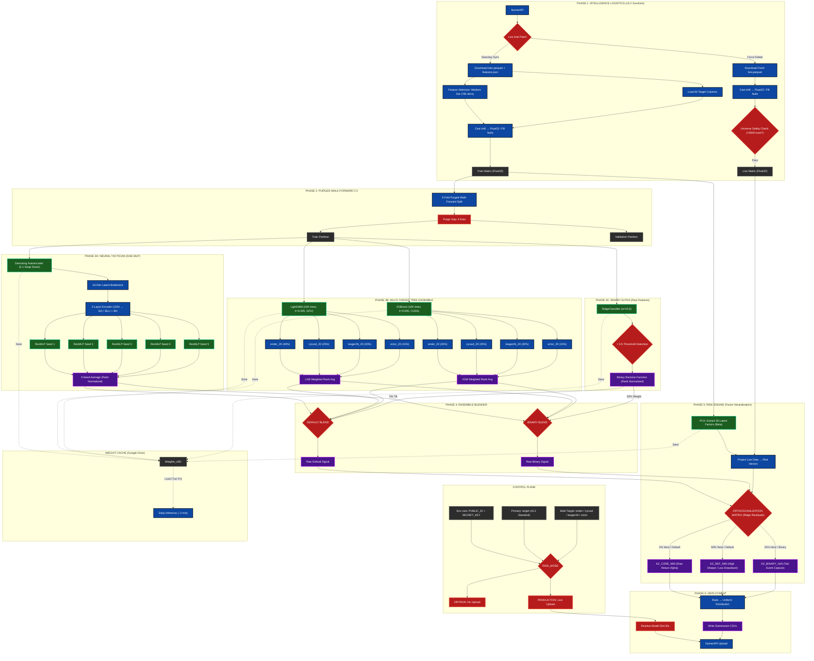

### Architectural Overview

The pipeline follows a six-phase architecture that separates signal generation from risk management. Raw v5.2 data flows through a Purged Walk-Forward CV split into three parallel alpha engines — a DAE-initialized neural ensemble, a multi-target gradient boosting ensemble, and a binary tail-event classifier. Their outputs converge at the Ensemble Blender, which constructs two distinct signal profiles (Default and Binary). The Risk Engine then orthogonalizes each signal against 50 PCA-derived market factors at varying neutralization ratios, producing three deployment-ready model slots with differentiated return profiles.

Author Profile
Brian Penrod, DBA Retired US Army Special Forces CSM | Doctor of Business Administration (Finance)

"I combine military strategic planning with advanced quantitative finance to build systems that prioritize risk management, data integrity, and tactical execution."
