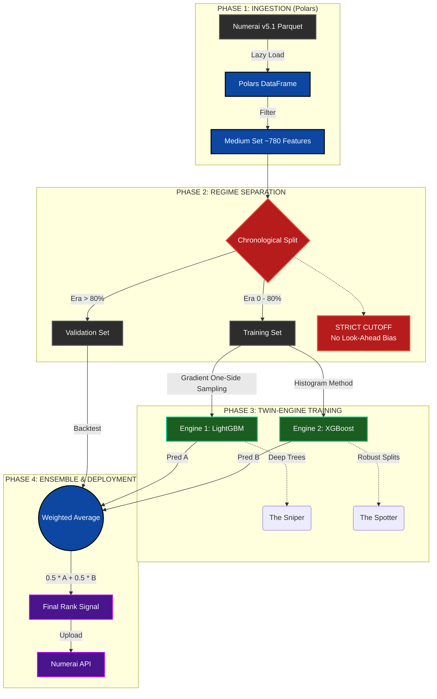

# System Architecture: Twin-Engine Market Neutral Strategy
**Status:** Production (v2.2)
**Infrastructure:** Google Colab Pro+ / NVIDIA A100

 ## Architectural Deep Dive

### 1. The "Twin-Engine" Doctrine (Ensemble Theory)
**Strategic Intent:** Variance Reduction & Signal Stability.

In high-noise financial environments, single-model architectures (e.g., a standalone XGBoost) often suffer from idiosyncratic overfitting—memorizing "noise" specific to the training era rather than learning generalized "signal."

To mitigate this, we deploy a **Heterogeneous Ensemble** (The "Twin Engines"):

* **Engine 1: LightGBM ("The Sniper")**
    * **Architecture:** Gradient-based One-Side Sampling (GOSS).
    * [cite_start]**Role:** Focuses on depth-wise leaf growth to capture complex, non-linear interactions in the "Medium" feature set[cite: 237].
* **Engine 2: XGBoost ("The Spotter")**
    * **Architecture:** Histogram-based splitting (`tree_method='hist'`).
    * [cite_start]**Role:** Prioritizes computational efficiency and broad structural patterns[cite: 238].

**The Output:**
[cite_start]By averaging the rank-normalized predictions ($0.5 \cdot P_{LGBM} + 0.5 \cdot P_{XGB}$), we effectively cancel out the uncorrelated errors of each individual model[cite: 238]. [cite_start]This increases the **Sharpe Ratio** (risk-adjusted return) by stabilizing performance across volatile market regimes[cite: 230].

---

### 2. The "Chronological Firewall" (Stationarity Defense)
**Strategic Intent:** Elimination of Look-Ahead Bias.

Standard data science practices (like Random K-Fold Cross-Validation) are catastrophic in finance. [cite_start]Randomly shuffling data allows a model to "peek" at future volatility to predict past returns, creating a theoretical performance that vanishes in live trading[cite: 11].

**Our Protocol:**
We enforce a strict **Chronological Firewall** in the validation logic:
1.  **Time-Series Split:** The dataset is ordered by `Era` (Time).
2.  [cite_start]**The Cutoff:** The model is trained *only* on the first 80% of history ($t_{0} \to t_{cutoff}$)[cite: 237].
3.  [cite_start]**The Test:** Validation occurs *only* on the subsequent 20% ($t_{cutoff} \to t_{end}$), ensuring the model is tested on "unseen future" data[cite: 7].

[cite_start]This architecture respects the **Non-Stationarity** of financial markets—acknowledging that the statistical properties of 2008 do not perfectly mirror 2024[cite: 12]. [cite_start]If the model survives this firewall with a Sharpe > 1.5, it is deemed production-ready[cite: 3].
